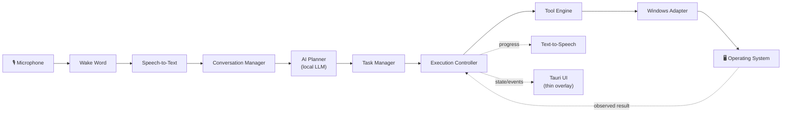

<div align="center">

# Pulse

**Control your computer through natural conversation.**

[](LICENSE)
[](#installation)
[](#known-limitations)
[](CONTRIBUTING.md)

</div>

---

Pulse is a **local, voice-first AI computer companion**. Say "Pulse," describe what you want to do, and Pulse understands your intent, performs the task on your actual desktop, and keeps you informed the entire time — no cloud round-trip, no account, no shortcuts to memorize.

```
You:   "Pulse, open Notepad and write 'how are you all?'"
Pulse: "Opening Notepad. Typing that in now. Done."
```

Designed with accessibility at its core, and built to be simple enough for anyone. Pulse is not an assistant that *complements* a screen reader — it's meant to let someone drive their whole computer by voice, full stop.

> **This is an early, honest preview**, not a finished product. It's public so people can install it, try it, break it, and tell us what's wrong — see [Known Limitations](#known-limitations) before you judge it too harshly.

## Table of Contents

- [Why Pulse Exists](#why-pulse-exists)
- [How It Works](#how-it-works)
- [Features](#features)
- [Screenshots](#screenshots)
- [Architecture](#architecture)
- [Installation](#installation)
- [Quick Start](#quick-start)
- [Superhero Mode](#-superhero-mode)
- [Roadmap](#roadmap)
- [Known Limitations](#known-limitations)
- [Contributing](#contributing)
- [Privacy](#privacy)
- [Accessibility](#accessibility)
- [License](#license)

## Why Pulse Exists

Modern computers expect users to learn shortcuts, menus, commands, and complex interfaces before getting real work done. For many people — especially those with visual impairments or limited mobility — those barriers turn everyday tasks into obstacles.

Pulse changes the interaction model: instead of learning how to use software, you describe what you want to accomplish, and Pulse figures out how.

## How It Works

1. **Wake** — Say "Pulse." It responds: *"I'm listening."*
2. **Understand** — Pulse interprets your intent rather than requiring exact commands: *"Open my electricity bill,"* *"Launch Chrome,"* *"Find my resume."*
3. **Plan** — Pulse breaks the request into a sequence of safe, concrete actions.
4. **Execute** — Pulse performs each step, narrating progress as it goes.
5. **Confirm** — Sensitive actions (deleting files, closing unsaved work) always ask first.

Under the hood, this is a real reason → act → observe → re-plan loop: Pulse states what it expects to happen next, checks that against what actually happened, and corrects course itself when reality doesn't match — rather than blindly executing a fixed script. See [Architecture](#architecture) for the technical shape of this.

## Features

### Core Principles
- **Accessibility First** — every interaction reduces uncertainty by keeping the user informed about what's happening.
- **Voice First** — voice is the primary interface; no keyboard shortcuts required.
- **Local & Private** — planning, speech recognition, and text-to-speech all run on-device using local models. No mandatory cloud calls.
- **Human Control** — Pulse never silently performs a sensitive action; you stay in control.

### What Pulse Can Do Today
- Open and close applications, files, and folders by name or description
- Read what's actually on screen (buttons, fields, links, visible text) to decide what to click or type
- Fall back to real visual analysis of a screenshot when text alone is ambiguous (two controls with the same label, an icon with no accessible name)
- Click, fill in fields, and send keyboard shortcuts across arbitrary Windows apps
- Drive the standard Windows Save dialog end-to-end (type a path, confirm, verify the file landed on disk)
- Search the local filesystem and the web
- Understand natural-language requests and hold a short back-and-forth to fill in missing details (e.g. "which file name?")
- Break a request into multiple steps and execute them as a supervised sequence, narrating progress the whole way
- Ask for confirmation before anything sensitive, and recover from mistakes instead of getting stuck in a loop

## Screenshots

Screenshots and a short demo GIF are being captured for this release — see [`docs/SCREENSHOTS_CHECKLIST.md`](docs/SCREENSHOTS_CHECKLIST.md) for exactly what's needed if you'd like to help. Once captured they'll replace this section.

## Architecture

Pulse is split into a thin, disposable **UI layer** and a headless **Core Engine** that owns all the actual intelligence — voice, planning, task state, and execution. The UI talks to the Core over a local WebSocket API and has no logic of its own; you could swap it out entirely without touching how Pulse thinks or acts.



Full detail — component responsibilities, the command-processing loop, the tool/observer/safety model, and startup sequence — lives in [`docs/ARCHITECTURE.md`](docs/ARCHITECTURE.md). Product philosophy and rationale live in [`product_bible.md`](product_bible.md) and [`tad.md`](tad.md).

**Stack**: Python core (planner client, task manager, tool executor, Windows UI-Automation adapter) · [`llama.cpp`](https://github.com/ggml-org/llama.cpp) serving a local Gemma model for planning and vision · Whisper-family STT · Kokoro TTS · a [Tauri](https://tauri.app) (Rust + web) overlay for the UI, talking to the core over a local WebSocket ([`docs/api.md`](docs/api.md)).

## Installation

Pulse is Windows-only today. A packaged one-click installer is in progress (see [Roadmap](#roadmap)) — for now, run it from source:

1. **Clone the repo**
   ```bash
   git clone https://github.com/aman2003s/pulse-ai.git
   cd pulse-ai
   ```
2. **Set up the Python environment**
   ```bash
   python -m venv venv
   venv\Scripts\activate
   pip install -e .
   ```
3. **Fetch the local models** (planner, STT, TTS, wake word)
   ```bash
   python scripts/fetch_models.py
   ```
4. **Run it**
   ```bash
   run.bat
   ```
   This starts the Python core, waits for it to be ready, then launches the UI (`ui/pulse-ui.exe`).

Full step-by-step instructions, hardware expectations, and troubleshooting live in [`docs/INSTALLATION.md`](docs/INSTALLATION.md) and [`docs/TROUBLESHOOTING.md`](docs/TROUBLESHOOTING.md). Setting up a dev environment to contribute code is covered in [`docs/DEVELOPER_SETUP.md`](docs/DEVELOPER_SETUP.md).

## Quick Start

Once Pulse is running:

1. Say **"Pulse"** and wait for it to respond.
2. Say what you want, in plain language — e.g. *"Open Notepad and write 'how are you all?'"*
3. Listen (or read the overlay) as Pulse narrates each step.
4. If Pulse needs a detail it doesn't have (a filename, a location), it'll ask — just answer normally.

See [`docs/QUICKSTART.md`](docs/QUICKSTART.md) for more example commands and what to expect from each.

## 🦸 Superhero Mode

For users who want continuous guidance rather than quiet automation. Most software goes silent once an action starts — Superhero Mode keeps Pulse narrating: typing, navigation, loading states, and other progress that would otherwise pass silently.

```
You:   "Pulse, enable Superhero Mode."
Pulse: "Superhero Mode activated. I'll guide you through everything I do."
You:   "Open my Downloads folder."
Pulse: "Opening Downloads. I'm reading the folder contents. I found 24 items
        including Documents, Images, and Videos. What would you like to do next?"
```

## Roadmap

Built incrementally, with each feature tested against real, messy, real-world apps before moving on.

**Current foundation**: voice interaction, wake word, local AI planning, on-screen understanding (text + visual fallback), multi-step task execution with self-correction, accessibility-tuned feedback.

**Near-term**:
- Packaged one-click Windows installer — see [`docs/INSTALLER_PLAN.md`](docs/INSTALLER_PLAN.md) for current status
- Optional launch-at-startup
- Broader, more reliable app coverage (this is where your bug reports matter most)

**Future**: browser automation, developer workflows, cross-platform support, a plugin/skill ecosystem, richer screen understanding.

## Known Limitations

Read this before filing "it doesn't work" — some of these are real, open problems, not surprises:

- **Windows only.** No macOS/Linux support yet.
- **Run-from-source only.** No installer yet — see [Roadmap](#roadmap).
- **Quality depends on the local model.** Planning runs on a small, locally-hosted model for speed and privacy, not a frontier cloud model — it will occasionally misjudge a step. Pulse is built to notice and self-correct when that happens, not to never make mistakes.
- **Apps with unusual save/session behavior can still confuse it.** Cloud-autosaving apps, or apps that resume a previous session instead of starting blank, are a known hard case — Pulse checks for this, but coverage isn't complete for every app.
- **Vision fallback is a real capability, not infallible.** It can misread low-contrast or very small on-screen elements, same as any vision model.
- **No sandboxing.** Pulse automates your real desktop through the same UI-Automation APIs a screen reader uses — it can click, type, and save files for real. Confirmation is required for sensitive actions, but review what you ask it to do.

Found something not listed here? [Open an issue](../../issues/new/choose) — that's exactly what this release is for.

## Contributing

Contributions happen through pull requests only — see [`CONTRIBUTING.md`](CONTRIBUTING.md) for the full workflow, [`docs/DEVELOPER_SETUP.md`](docs/DEVELOPER_SETUP.md) to get a dev environment running, and [`CODE_OF_CONDUCT.md`](CODE_OF_CONDUCT.md) for how we expect people to treat each other here.

Not sure where to start? Small, well-scoped bug reports and fixes are the most valuable thing right now — see [Known Limitations](#known-limitations) above.

## Privacy

Pulse's planning, speech recognition, and text-to-speech run on local models on your machine. Voice audio and screen content are processed locally to decide what to do — they are not sent to a cloud AI provider as part of Pulse's own operation. Some tools (e.g. web search) necessarily make outbound network requests when you explicitly ask for something that needs the internet. Pulse does not phone home, collect analytics, or require an account.

## Accessibility

Accessibility is not a feature layered on top of Pulse — it's the reason Pulse exists. It's built for people with visual impairments or limited mobility to operate a full Windows desktop by voice, and tuned (via [Superhero Mode](#-superhero-mode) and configurable feedback levels) to keep users continuously informed rather than leaving them guessing what's happening. If something about Pulse gets in the way of that goal, please [open an issue](../../issues/new/choose) — accessibility reports get priority.

## Built with Open Technologies

Pulse is powered by open technologies: local language models, speech recognition, text-to-speech, and wake-word detection. The project exists to demonstrate that capable AI assistants can be built while respecting user privacy and keeping users in control.

## License

Pulse is licensed under the [PolyForm Noncommercial License 1.0.0](LICENSE) — free for personal use, education, research, and contributions. Commercial use requires permission from the licensor. See [`LICENSE`](LICENSE) for the full terms.

---

<div align="center">

© 2026 Pulse Project

</div>
