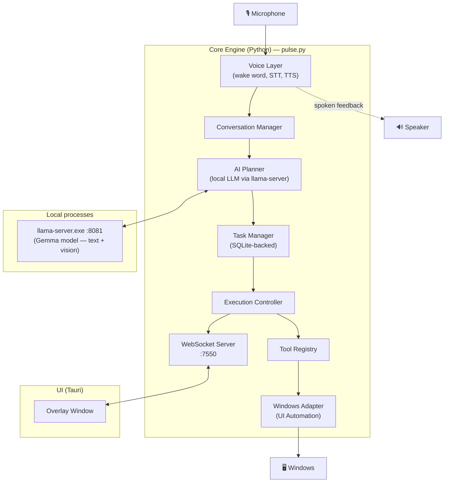
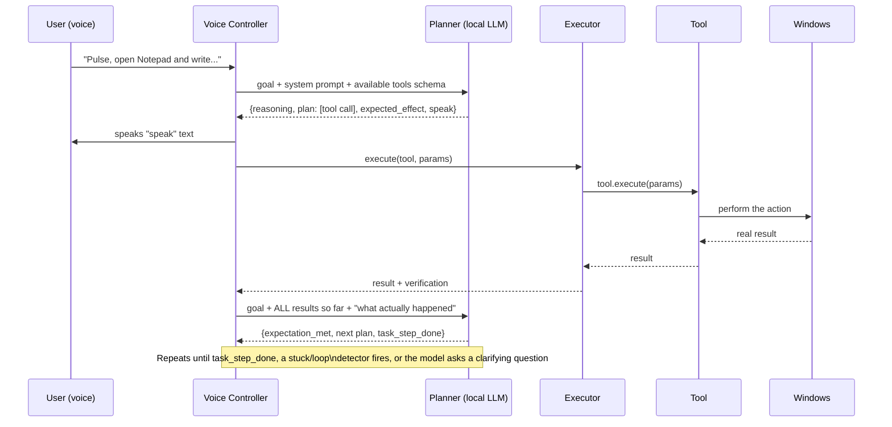
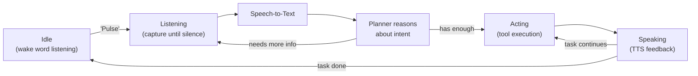
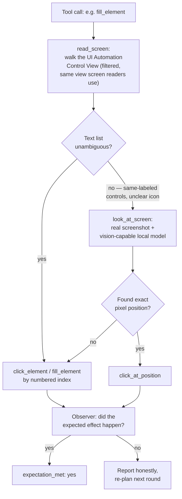
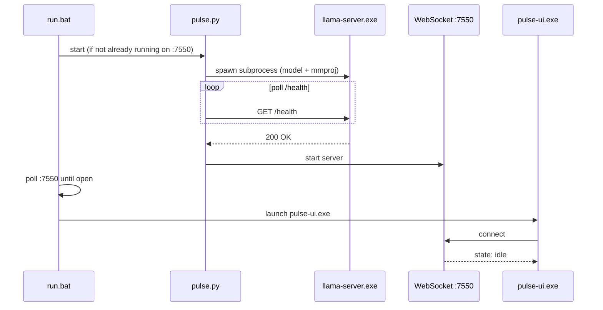

# Pulse Architecture

This document describes how Pulse is actually built today. For the *why* behind these choices, see [`product_bible.md`](../product_bible.md) (product philosophy) and [`tad.md`](../tad.md) (original technical architecture document — this file is the as-built version of that).

## High-Level Architecture

Pulse is split into two independently-runnable pieces:

- **Core Engine** (Python) — owns everything: voice, planning, task state, tool execution, and Windows automation. Runs headless; the UI is optional.
- **UI** (Tauri — Rust + web) — a thin, stateless overlay that renders what the Core tells it to and forwards input. No business logic lives here.

They communicate over a local WebSocket ([`docs/api.md`](api.md)), so the UI could be swapped or removed entirely without touching how Pulse thinks or acts.

## Component Responsibilities

| Component | File(s) | Responsibility |
|---|---|---|
| Wake Word | `core/voice/wake_listener.py` | Always-on, local, low-CPU listening for the "Pulse" wake word |
| Capture / STT | `core/voice/capture.py`, `core/voice/stt.py` | Records after wake, transcribes speech to text locally |
| TTS | `core/voice/tts.py` | Converts responses to speech (Kokoro) |
| Voice Controller | `core/voice/controller.py` | Orchestrates the whole reason → act → observe → re-plan loop (see below) |
| Conversation Manager | `core/conversation.py` | Tracks in-progress conversation/task context |
| Planner Client | `core/planner/client.py` | Talks to the local `llama-server` — both the fast, schema-constrained text planning calls and the slower vision-analysis calls |
| Prompts | `core/planner/prompts.py` | The system prompt and rules the planner reasons under |
| Task Manager | `core/task_manager.py` | Persists task state (goal, steps, status) to SQLite so tasks can pause/resume/recover |
| Tool Registry | `core/tools/registry.py` | Defines the JSON schema the planner must respond in, and the list of available tools |
| Tools | `core/tools/*.py` | The actual actions — `open_app`, `read_screen`, `look_at_screen`, `fill_element`, `save_file`, etc. |
| Executor | `core/executor/executor.py` | Runs a tool call with a timeout, handles confirmation gating |
| Windows Adapter | `core/adapters/win/*.py` | UI Automation-based focus handling, app indexing, file indexing |
| WebSocket Server | `core/api/ws_server.py` | Bridges Core state/events to the UI (`docs/api.md`) |
| UI | `ui/src/`, `ui/src-tauri/` | Tauri overlay — pure presentation, no logic |

## Command Processing Flow

This is the actual loop every request goes through — a "reason → act → observe → re-plan" pattern, not a single fixed script. Each round, the planner states what it expects to happen next; the next round compares that against the real tool result and self-corrects if they don't match (this is what the codebase calls TVAE — Thinking / Verification / Action / Expectation).

Two independent safety nets run alongside this loop, both **in code**, not left to the model to self-police:
- **Exact-repeat loop detection** — the same tool call 3 times in a row triggers a corrective hint, then parks the task if it happens again.
- **No-progress detection** — tracks the model's own `expectation_met` honesty signal across rounds; if it says "didn't work" 5 times running (even with *different* actions each time), it's nudged to try a fundamentally different approach, and parked after 9 if that doesn't help.

## Voice Processing Pipeline

## Automation Pipeline (how Pulse actually touches an app)

This is the part that changed the most during real-world testing — see [`FLOW_PLAN.md`](../FLOW_PLAN.md) for the detailed history of why each piece exists.

Key design choice: **read_screen uses UI Automation's Control View, not the raw tree.** Real screen readers (NVDA, JAWS, Narrator) already solve "ignore an app's own decorative chrome" this way — Pulse uses the same standard mechanism rather than inventing per-app filtering.

## Error Handling

- **Tool-level timeouts** — each tool declares its own `timeout_s` (a fast click vs. a save-dialog wait need different budgets); `ToolExecutor` runs the tool in a thread and reports a timeout rather than hanging the whole conversation.
- **Self-healing retries** — transient "app is still rendering" states (e.g. right after `open_app`) get a short bounded retry inside the tool itself, not surfaced as a failure the model has to work around.
- **Loop / no-progress detection** — see [Command Processing Flow](#command-processing-flow) above.
- **Precondition gates** — before a potentially destructive action (e.g. typing into a document), code-level checks verify the assumption is actually true (e.g. "is this really a blank document, or did the app resume unrelated old content?") rather than trusting the model's self-report for something well-defined and checkable.
- **Escalating honesty on repeated failure** — e.g. a save that can't be verified on disk gets progressively more specific guidance, then an honest "here's what I can't confirm" report to the user instead of looping forever.

## Startup Flow

`pulse.py` also watches the `llama-server` subprocess and restarts it if it crashes, and falls back across ports `8081` → `8082` → `8083` if one is already in use.

## UI Architecture

The Tauri overlay (`ui/src-tauri/tauri.conf.json`) is a small, transparent, always-on-top, undecorated window — deliberately not a normal app window, since it's meant to sit alongside whatever the user is actually working in. It:

- Connects to the Core's WebSocket and renders `state` (idle/listening/thinking/acting/speaking), `transcript`, and `feedback` events.
- Sends `text_command` (a text-based alternative to voice, useful for testing and for users who prefer typing) and `set_config` events back.
- Contains no planning, task, or tool logic — every decision is made in the Core; the UI only reflects state.

See [`docs/api.md`](api.md) for the full WebSocket event contract.
